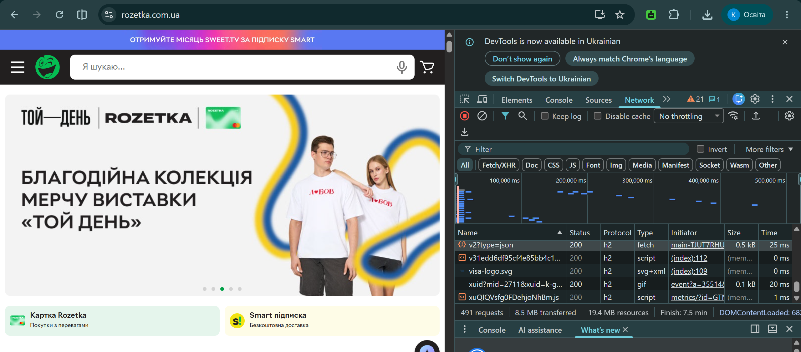
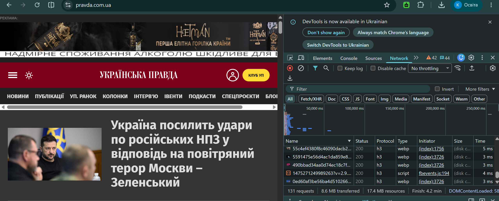

# Звіт з самостійної роботи №13

## 1. Спостереження за версіями HTTP на реальних сайтах

За допомогою інструментів розробника браузера (вкладка **Network**, колонка **Protocol**) зафіксовано характеристики завантаження головних сторінок двох сайтів за варіантом 12:

| Сайт / Домен | Категорія сайту | Версія протоколу | Кількість з'єднань до хоста | Кількість ресурсів з основного хоста |
| :--- | :--- | :--- | :--- | :--- |
| **rozetka.com.ua** | Інтернет-магазин | `h2` (HTTP/2) | 1 (TCP + TLS) | 483 |
| **pravda.com.ua** | Новинний портал | `h3` (HTTP/3) | 1 (UDP / QUIC сесія) | 122 |

*Скріншоти-підтвердження з інструментів розробника (DevTools -> Network):*

* **Скріншот 1 (`rozetka.com.ua` — `h2`):**
 

* **Скріншот 2 (`pravda.com.ua` — `h3`):**

## 2. Аналіз мультиплексування ресурсів

Під час завантаження головної сторінки інтернет-магазину `rozetka.com.ua` спостерігається ефект мультиплексування: 483 окремі ресурси (зображення товарів, CSS-стилі, JS-скрипти та шрифти) були завантажені з єдиного хоста через 1 TCP-з'єднання за допомогою протоколу HTTP/2 (`h2`). На сайті `pravda.com.ua` 122 ресурси завантажилися через єдину транспортну сесію HTTP/3 (`h3`). Завдяки мультиплексуванню браузер передає всі запити та відповіді паралельно у вигляді незалежних кадрів через один фізичний канал без потреби відкривати десятки окремих TCP-з'єднань, як це робилося в HTTP/1.1.

## 3. Порівняльна таблиця HTTP/1.1, HTTP/2 і HTTP/3

| Критерій | HTTP/1.1 | HTTP/2 | HTTP/3 |
| :--- | :--- | :--- | :--- |
| **Транспорт в основі** | TCP (з окремим TLS-рукостисканням для HTTPS) | TCP + TLS 1.2/1.3 | QUIC (поверх UDP з вбудованим TLS 1.3) |
| **Мультиплексування** | Відсутнє (послідовна обробка або створення 6 паралельних TCP-з'єднань) | Апаратне мультиплексування бінарних фреймів у межах одного TCP-з'єднання | Повноцінне мультиплексування незалежних потоків поверх UDP без взаємного блокування |
| **Стиснення заголовків** | Відсутнє (заголовки передаються текстовим виглядом) | Алгоритм **HPACK** (використання статичних та динамічних таблиць) | Алгоритм **QPACK** (адаптований під асинхронну передачу пакетів у QUIC) |

## 4. Блокування черги (Head-of-Line Blocking) і його вирішення в QUIC

**Проблема блокування черги (HoL Blocking) на рівні TCP:**  
У протоколі HTTP/2 мультиплексування реалізовано всередині єдиного TCP-з'єднання. Оскільки TCP гарантує суворо впорядковану доставку байтового потоку, втрата хоча б одного IP-пакета призводить до того, що стек TCP зупиняє передачу всіх наступних даних до моменту повторного отримання втраченого пакета. Через це всі мультиплексовані HTTP/2-потоки блокуються на рівні транспорту, навіть якщо втрачений пакет стосувався лише одного конкретного зображення.

**Як QUIC розв'язує цю проблему поверх UDP:**  
Протокол QUIC розроблений поверх UDP, який не вимагає глобального впорядкування загального потоку пакетів. QUIC інкапсулює кожен HTTP-потік як повністю незалежну сутність на транспортному рівні. Якщо під час передачі втрачається пакет, що належить до потоку №1, це зупиняє обробку лише цього конкретного потоку, тоді як дані для потоків №2, №3 і №4 продовжують негайно оброблятися та передаватися застосунку без жодних затримок.

## Відповіді на контрольні запитання

1. **Як визначити версію HTTP-протоколу у вкладці Network?**  
   Для цього потрібно відкрити Інструменти розробника (`F12`), перейти на вкладку **Network**, натиснути правою кнопкою миші на шапці таблиці запитів і ввімкнути колонку **Protocol**. У цій колонці відображатимуться значення: `http/1.1`, `h2` (HTTP/2) або `h3` (HTTP/3 / QUIC).

2. **Що таке мультиплексування запитів і чим воно відрізняється від паралельних з'єднань HTTP/1.1?**  
   Мультиплексування — це техніка передачі багатьох незалежних запитів та відповідей одночасно через один мережевий канал у вигляді бінарних кадрів. На відміну від HTTP/1.1, де створювалося до 6 окремих TCP-з'єднань, мультиплексування використовує єдине з'єднання без накладних витрат на повторні рукостискання.

3. **У чому суть проблеми блокування черги на рівні TCP?**  
   TCP сприймає всі мультиплексовані дані як єдиний суцільний байтовий потік. Якщо хоча б один пакет з цього потоку губиться в мережі, TCP затримує доставку усіх наступних пакетів для всіх потоків доти, доки втрачений пакет не буде пересланий повторно.

4. **Чому QUIC побудований поверх UDP, а не є розширенням самого TCP?**  
   QUIC створено поверх UDP для усунення жорсткого впорядкування пакетів на рівні ядра ОС та забезпечення незалежності потоків. Крім того, оновлення TCP вимагало б зміни ядер операційних систем на мільйонах мережевих пристроїв по всьому світу, тоді як QUIC поверх UDP працює в user-space і оновлюється разом із браузерами.