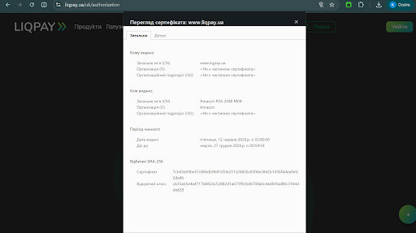

# Звіт з самостійної роботи №14
**Варіант:** 12  
**Сайт для аналізу:** Платіжна система (`liqpay.ua`)  
**Сценарій атаки:** Підміна DNS через зламаний домашній роутер  

## 1. Картка TLS-сертифіката сайту

На основі огляду параметрів безпеки з'єднання платіжного сервісу `liqpay.ua` заповнено картку сертифіката:

| Поле сертифіката | Значення зі скріншоту |
| :--- | :--- |
| **Домен (Subject / Common Name):** | `www.liqpay.ua` |
| **Видавець (Issuer / CA):** | `Amazon RSA 2048 M04` (Amazon) |
| **Термін дії (Validity Period):** | від 12.06.2026 р. до 27.12.2026 р. |
| **Версія TLS:** | `TLS 1.3` (або `TLS 1.2` залежно від параметрів сесії) |

### Скріншот підтвердження перегляду сертифіката

## 2. Рукостискання TLS 1.3 та перевірки браузера

### Послідовність кроків рукостискання TLS 1.3:

1. **ClientHello:** Клієнт (браузер) надсилає серверу список підтримуваних версій TLS, набори криптографічних шифрів (cipher suites) та свій публічний ключ для узгодження ключів сеансу (Diffie-Hellman).
2. **ServerHello + Сертифікат + Ключ:** Сервер обирає параметри шифрування, надсилає свій публічний ключ, а також свій X.509 цифровий сертифікат для автентифікації.
3. **Перевірка сертифіката клієнтом:** Браузер перевіряє справжність отриманого сертифіката за трьома обов'язковими критеріями перед встановленням довіри.
4. **Підтвердження та шифрований обмін:** Після успішної перевірки обидві сторони обчислюють спільний симетричний ключ сеансу (Session Key) і переходять до зашифрованого обміну даними (HTTP over TLS / HTTPS).

### Що перевіряє браузер на кроці 3 та відповідні помилки:

* **Перевірка 1: Відповідність домену (Domain Matching).**  
  Браузер перевіряє, чи відповідає ім'я домену в адресному рядку полю *Subject Alternative Name (SAN)* або *Common Name (CN)* у сертифікаті.  
  * *Помилка браузера при невідповідності:* **`NET::ERR_CERT_COMMON_NAME_INVALID`** (або "SSL certificate name mismatch").

* **Перевірка 2: Термін дії (Validity Period).**  
  Браузер порівнює поточну системну дату та час пристрою з полями *Not Before* та *Not After* у сертифікаті.  
  * *Помилка браузера при порушенні:* **`NET::ERR_CERT_DATE_INVALID`** (або "Certificate Has Expired").

* **Перевірка 3: Довіра до видавця (Chain of Trust / CA Trust).**  
  Браузер перевіряє цифровий підпис сертифіката, будуючи ланцюжок довіри до одного з кореневих центрів сертифікації (Root CA), що є у вбудованому сховищі довірених сертифікатів ОС/браузера.  
  * *Помилка браузера при відсутності довіри:* **`NET::ERR_CERT_AUTHORITY_INVALID`** (або "Untrusted Root Certificate").

## 3. Розбір сценарію атаки
**Аналіз атаки:**  
У разі компрометації домашнього роутера зловмисник змінює настройки IP-адрес DNS-серверів на підконтрольний йому фальшивий DNS. Коли користувач вводить у браузері адресу платіжної системи (`liqpay.ua`), підроблений DNS повертає IP-адресу фішингового сервера-двійника замість реального сервера банку.

**Порушена властивість CIA:**  
Атака порушує **Конфіденційність (Confidentiality)** та **Цілісність (Integrity)**, оскільки користувача обманом змушують передати свої платіжні реквізити та паролі сторонній особі на підробленому ресурсі.

**Контрзаходи (технічні механізми):**

1. **Сувора перевірка TLS-сертифіката браузером:** Фішинговий сервер не має легітимного цифрового сертифіката для домену платіжної системи, підписаного довіреним CA. Якщо користувач не ігноруватиме попередження браузера про помилку `NET::ERR_CERT_COMMON_NAME_INVALID`, атака зупиниться.
2. **Використання DoH / DoT (DNS over HTTPS / DNS over TLS):** Налаштування в браузері або ОС зашифрованого DNS-протоколу дозволяє запитам ігнорувати компрометовані DNS-налаштування домашнього роутера та отримувати захищені й підписані DNS-відповіді безпосередньо від довіреного провайдера.
3. **Використання шифрованого VPN-тунелю:** Запуск VPN передає весь мережевий трафік (включаючи DNS-запити) через зашифроване з'єднання безпосередньо до VPN-шлюзу, роблячи конфігурацію зламаного роутера недієвою.

## 4. Порівняльна таблиця TLS і VPN

| Критерій | TLS (Transport Layer Security) | VPN (Virtual Private Network) |
| :--- | :--- | :--- |
| **Що шифрується** | Шифрується лише **окреме застосункове з'єднання** (наприклад, сесія браузера з конкретним вебсайтом за HTTPS). | Шифрується **весь мережевий трафік пристрою** (усі пакети від усіх застосунків) до VPN-шлюзу. |
| **Типовий сценарій використання** | Безпечна передача конфіденційних даних (паролі, платіжні картки) між користувачем та конкретним вебсервером через відкриту мережу. | Захист усього трафіку при роботі через незахищені мережі (наприклад, відкритий Wi-Fi) або безпечний віддалений доступ до корпоративної мережі компанії. |

## Відповіді на контрольні запитання

1. **Які поля сертифіката перевіряє браузер під час TLS-з'єднання?**  
   Браузер перевіряє: доменне ім'я (*Subject Alternative Name / Common Name*), термін придатності (*Not Before* та *Not After*), цифровий підпис видавця (*Issuer / Root CA*), а також статус відкликання сертифіката (через *CRL* або *OCSP*).

2. **Яку помилку покаже браузер при невідповідності домену сертифіката?**  
   Браузер відобразить помилку **`NET::ERR_CERT_COMMON_NAME_INVALID`** (або повідомлення про те, що ім'я домену в сертифікаті не відповідає запитаному сайту).

3. **Чим VPN відрізняється від TLS за обсягом захищеного трафіку?**  
   TLS захищає дані лише одного конкретного з'єднання (наприклад, однієї вкладки браузера), залишаючи решту трафіку пристрою без змін, тоді як VPN створює зашифрований тунель для абсолютно всього мережевого трафіку пристрою на транспортному/мережевому рівні.