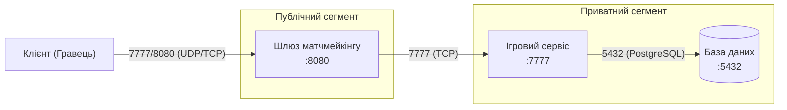

# Звіт з самостійної роботи №15

**Варіант:** 12  
**Застосунок:** Ігровий сервер (шлюз матчмейкінгу, ігровий сервіс, база даних)  
**Вимога до ізоляції:** Обмежений egress ігрового сервісу лише до бази даних  


## 1. Мережева схема застосунку

Архітектура ігрової системи розділена на два сегменти:
* **Публічний сегмент:** Шлюз матчмейкінгу (Matchmaking Gateway), який приймає підключення від гравців.
* **Приватний сегмент:** Ігровий сервіс (Game Logic Service) та База даних (Database).


Текстова ASCII-схема:

```text
[ Публічний сегмент ]                  [ Приватний сегмент ]
+---------------------+                  +-------------------+      +-------------------+
| Шлюз матчмейкінгу   | ----(7777)-----> | Ігровий сервіс    | ---> | База даних        |
| (port: 8080)        |                  | (port: 7777)      |(5432)| (port: 5432)      |
+---------------------+                  +-------------------+      +-------------------+
         ^
         | (8080/UDP/TCP)
     [Гравець]
```
*Примітка:* Відповідно до вимог варіанту 12, для ігрового сервісу встановлено суворі правила Egress-фільтрації — вихідні підключення дозволені виключно до порту бази даних (`5432`). Спроби з'єднання з будь-якими іншими ресурсами чи інтернетом блокуються.


## 2. Режим мережі контейнерів та виявлення сервісів

Для розгортання даного застосунку обрано ізольовану користувацьку **bridge-мережу** (custom bridge network в Docker / Compose). Цей режим забезпечує повністю автономне мережеве середовище з вбудованим DNS-сервером, що дозволяє контейнерам знаходити один одного за відповідними іменами (наприклад, `http://game-service:7777` або `postgres://db:5432`). Режим **host** не обрано, оскільки він ділить мережевий стек з хост-системою і не дозволяє реалізувати граничні правила Egress-ізоляції для ігрового сервісу, що суперечить умові завдання. Режим **overlay** не використовується, оскільки вся система функціонує в межах одного хоста без потреби розгортання мульти-вузлового Swarm/K8s кластера.


## 3. Таблиця груп безпеки (Security Groups)

| Сервіс | Дозволений вхідний порт (Ingress) | Дозволений вихід (Egress) / Джерело (Source) | Призначення / Опис |
| :--- | :--- | :--- | :--- |
| **Шлюз матчмейкінгу (Gateway)** | `8080/TCP` | `0.0.0.0/0` (Усі користувачі) | Прийом підключень та запитів на пошук гри від гравців. |
| **Ігровий сервіс (Game Service)** | `7777/TCP` / `UDP` | **Обмежений Egress:** Дозволено доступ *лише* до `Бази даних:5432` | Обробка ігрової логіки. Вихідний трафік обмежено лише базою. |
| **База даних (Database)** | `5432/TCP` | `Ігровий сервіс` (`Game Service`) | Збереження прогресу, сесій та профілів гравців. |

## 4. Метрики та порядок діагностики недоступності

### Перелік необхідних метрик:
* **Healthcheck (Стан сервісів):** Метрика `up` або перевірка логічного статусу гри/процесів (`1` — працює, `0` — недоступний).
* **Затримка відповіді (Latency / Ping / RTT):** Метрика `game_tick_duration_seconds` або затримка відповіді ігрового сервера/бази даних у мілісекундах (p95 / p99).
* **Частка помилок (Error Rate):** Відсоток розривів сесій, помилок автентифікації чи невдалих запитів до бази даних (`5xx` / Connection Failed).
* **Використання ресурсів (Resource Usage):** Використання CPU (`container_cpu_usage_seconds_total`), оперативної пам'яті (`container_memory_usage_bytes`) та активних сокетів підключення.

### Порядок діагностики недоступності:

1. **Крок 1 (Швидка перевірка — Мережа та Резолв):**  
   Перевірити перезолв DNS-імен та доступність портів між сервісами за допомогою команд `ping`, `nslookup` та `nc -zv db 5432` з контейнера ігрового сервісу.
2. **Крок 2 (Аналіз процесів та ресурсів):**  
   Аналіз системного навантаження через `docker stats` або метрики Prometheus для перевірки переповнення RAM (OOM), піків CPU або вичерпання ліміту відкритих файлів/сокетів.
3. **Крок 3 (Глибокий аналіз логів та трасування):**  
   Аналіз логів контейнерів через `docker logs game-service` та `docker logs db` на наявність фатальних помилок гри, збоїв підключення до БД чи блокування трафіку правилами безпеки.

## Відповіді на контрольні запитання

1. **Чому базі даних чи черзі повідомлень зазвичай не варто відкривати порт назовні?**  
   Це робиться для мінімізації поверхні атаки. Відкритий порт бази даних у публічному доступі робить її вразливою до брутфорсу, сканування портів ботами та прямих атак на витік даних.

2. **Який режим мережі контейнерів підходить для сервісу без потреби в максимальній ізоляції, і чому це рідко виправданий вибір?**  
   Підходить режим **`host`**. Це рідко виправдано, оскільки контейнер повністю втрачає мережеву ізоляцію, може викликати конфлікти портів на сервері та створює загрозу безпеці всієї системи в разі компрометації.

3. **Яку перевірку варто виконати першою при повідомленні «сервіс недоступний»?**  
   Першочергово слід виконати перевірку DNS-резолву та доступності потрібного мережевого порту між сервісами (наприклад, за допомогою `ping` або `nc`/`telnet`).