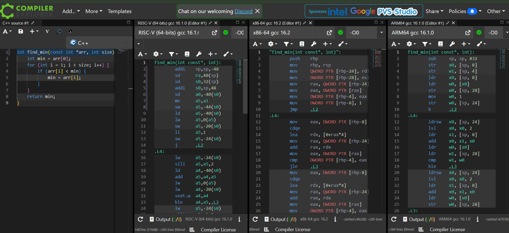
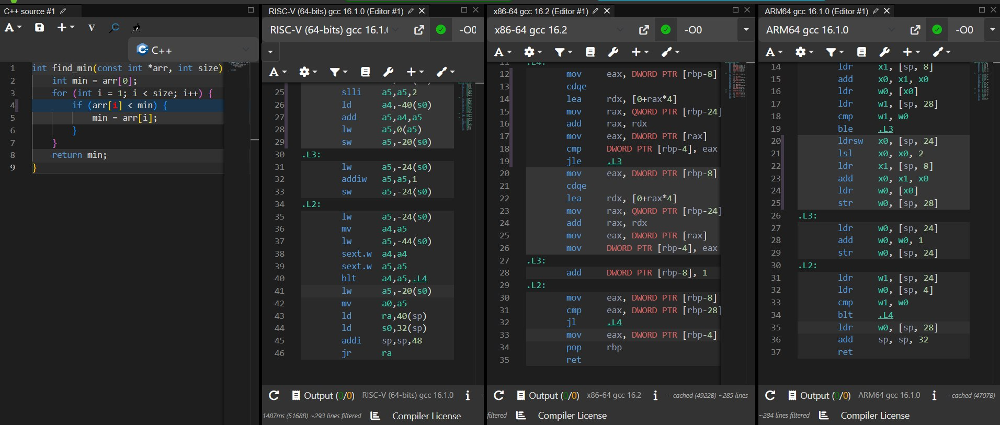

# Самостійна робота №7

## 🛠️ Вихідний код мовою C

```c
int find_min(const int *arr, int size) {
    int min = arr[0];
    for (int i = 1; i < size; i++) {
        if (arr[i] < min) {
            min = arr[i];
        }
    }
    return min;
}
```

##  Скріншоти з Compiler Explorer 



##  Аналіз та порівняння

### Таблиця 1. Архітектура — кількість інструкцій

| Архітектура | Кількість інструкцій |
| --- | --- |
| x86-64 | 26 |
| ARM64 | 31 |
| RISC-V (64-bit) | 36 |

### Таблиця 2. Передача аргументів та регістр результату

| Архітектура | Регістр(и) аргументів | Регістр результату |
| --- | --- | --- |
| x86-64 | rdi (вказівник arr`), `esi (розмір size`) | `eax |
| ARM64 | x0 (вказівник arr`), `w1 (розмір size`) | `w0 |
| RISC-V | a0 (вказівник arr`), `a1 (розмір size`) | `a0 |

##  Висновок

У цій роботі було досліджено асемблерний код функції пошуку мінімального елемента масиву для трьох архітектур без увімкненої оптимізації (`-O0`).

1. Особливості адресації пам'яті:
Для доступу до елемента масиву за індексом arr[i] x86-64 ефективно використовує індексну адресацію через lea rdx, [0+rax*4] або вирази з масштабуванням. Натомість RISC-архітектури розбивають обчислення адреси елемента на кілька простих кроків:
* Зсув індексу на 2 біти вліво для множення на 4 (розмір int`): `lsl у ARM64 та slli у RISC-V.
* Додавання зсуву до базової адреси масиву: add.
* Явне завантаження значення за розрахованою адресою: ldr / lw.


2. Принцип Load/Store:
Через відсутність оптимізації RISC-архітектури демонструють суттєво більшу кількість інструкцій (36 у RISC-V проти 26 у x86-64). Вони не можуть виконувати порівняння або операції збереження безпосередньо з пам'яттю, що змушує компілятор регулярно виконувати розвантаження та завантаження через стек (`sp` / `s0`).

##  Відповіді на контрольні запитання

1. Чому в RISC-архітектурах арифметичні команди не можуть напряму звертатися до пам'яті?
Це фундаментальний принцип концепції Load/Store. Відмова від прямого доступу арифметичних команд до пам'яті спрощує конвеєр та декодер процесора, гарантуючи, що всі обчислювальні інструкції працюють лише з регістрами з фіксованим і швидким часом доступу.
2. Чи завжди більша кількість інструкцій в асемблерному коді означає повільніше виконання? Від чого це залежить?
Ні, не завжди. Команди RISC є простими й здебільшого виконуються за 1 такт, а їхня проста структура дозволяє досягати вищих тактових частот. CISC-інструкції x86 можуть бути складними й вимагати багатьох тактів мікрокоду для виконання однієї операції.
3. Наведіть приклад ситуації, коли складна CISC-команда x86 виконує роботу кількох RISC-команд.
У x86-64 адресація [0+rax*4] здатна одночасно помножити індекс на розмір елемента (4 байти) і додати базову адресу. У RISC-V для цієї ж дії потрібно окремо виконати бітовий зсув slli a5, a5, 2 та додавання add a5, a4, a5.