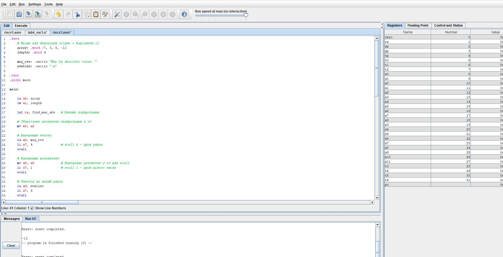
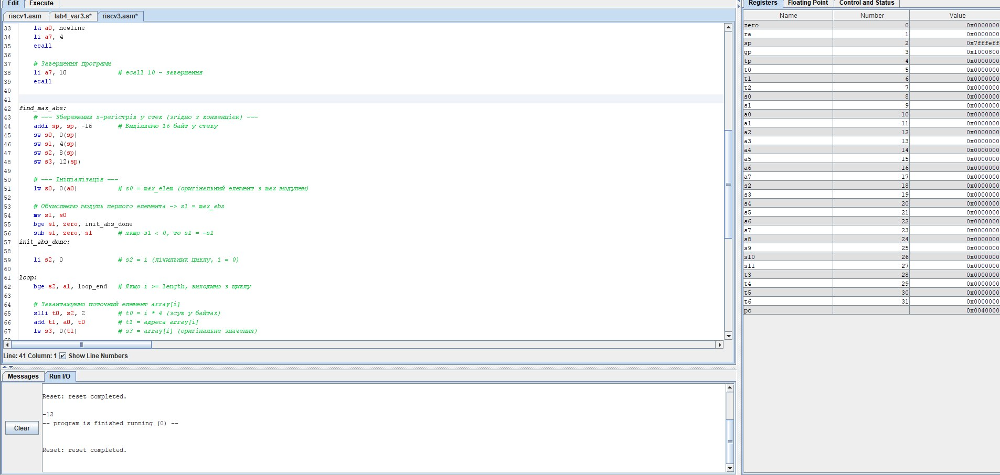
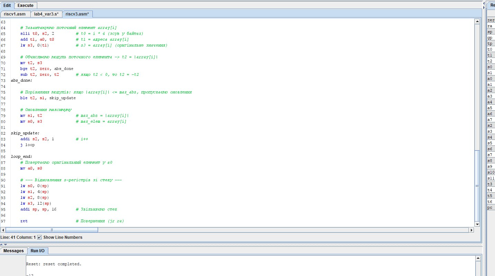
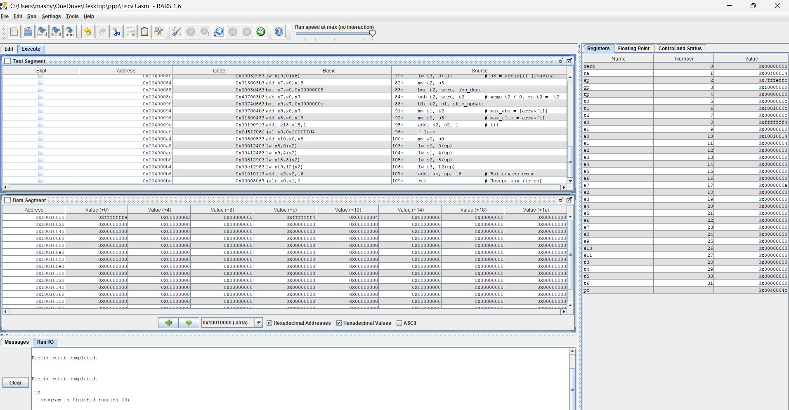
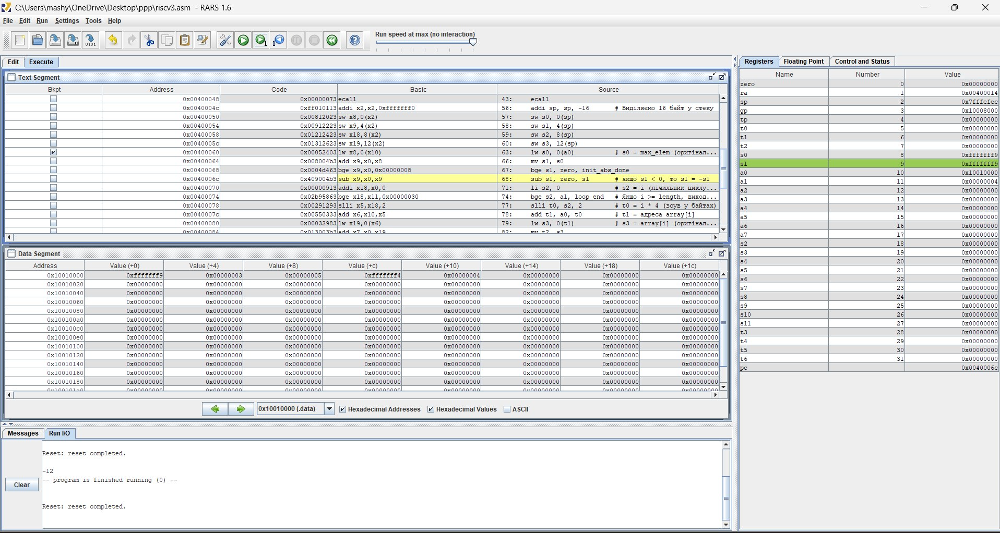

# ЗВІТ з практичного заняття №4

Варіант: №12

### 1. Текст програми 

### 2. Результат виконання програми та консольне виведення

Програму успішно зкомпільовано та виконано в середовищі RARS 1.6.

### 3. Ручний розрахунок для масиву варіанта

Вхідні дані: array = [-7, 3, 5, -12], length = 4

1. Ініціалізація ($i = 0$):
* Завантажуємо перший елемент: max_elem = -7.
* Обчислюємо модуль: max_abs = |-7| = 7.

2. Ітерація 1 ($i = 0$):
* Елемент: -7, модуль: 7.
* Порівняння: $7 \le 7 \rightarrow$ оновлення відсутнє.

3. Ітерація 2 ($i = 1$):
* Елемент: 3, модуль: |3| = 3.
* Порівняння: $3 \le 7 \rightarrow$ оновлення відсутнє.

4. Ітерація 3 ($i = 2$):
* Елемент: 5, модуль: |5| = 5.
* Порівняння: $5 \le 7 \rightarrow$ оновлення