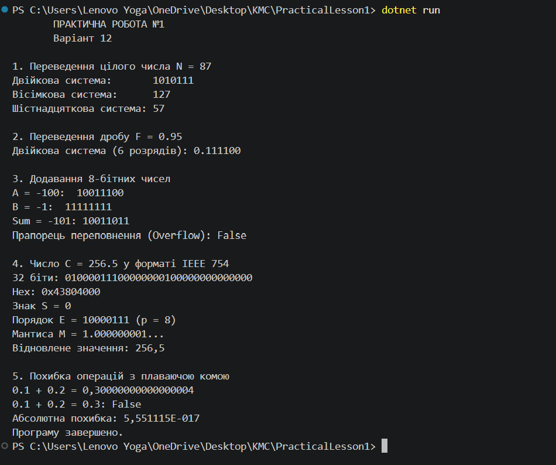

# Звіт з практичної №1

## Вхідні дані

N = 87 (ціле число)

F = 0.95 (дріб)

A = -100, В = -1 (числа для додавання)

C = 256.5 (число у форматі IEEE 754)

## Крок 1. Ручні розрахунки

### 1. Переведення цілого числа N = 87

У двійкову систему (q = 2):

87 / 2 = 43 (остача 1);

43 / 2 = 21 (остача 1);

21 / 2 = 10 (остача 1);

10 / 2 = 5 (остача 0);

5 / 2 = 2 (остача 1);

2 / 2 = 1 (остача 0);

1 / 2 = 0 (остача 1);

Результат: 1010111

У вісімкову систему (q = 8):

87 / 8 = 10 (остача 7);

10 / 8 = 1 (остача 2);

1 / 8 = 0 (остача 1);

Результат: 127

У шістнадцяткову систему (q = 16):

87 / 16 = 5 (остача 7);

5 / 16 = 0 (остача 5);

Результат: 57

### 2. Переведення дробу F = 0.95 у двійкову систему (6 розрядів після коми)

0.95 * 2 = 1.90 (ціла частина 1, залишок 0.90);

0.90 * 2 = 1.80 (ціла частина 1, залишок 0.80);

0.80 * 2 = 1.60 (ціла частина 1, залишок 0.60);

0.60 * 2 = 1.20 (ціла частина 1, залишок 0.20);

0.20 * 2 = 0.40 (ціла частина 0, залишок 0.40);

0.40 * 2 = 0.80 (ціла частина 0, залишок 0.80);

Результат: 0.111100

### 3.

A (-100): 10011100

B (-1): 11111111

Sum: 10011011 (Десяткове: -101)

Прапорець переповнення (Overflow): False

### 4

Число C = 256.5

32 біти: 01000011100000000100000000000000 (0x43804000)

Знак S=0, Порядок E=10000111 (p=8), Мантиса M=1.000000001...

Відновлене значення: 256.5

### 5

0.1 + 0.2 = 0.30000000000000004

0.1 + 0.2 = 0.3: False
### Результат коду
