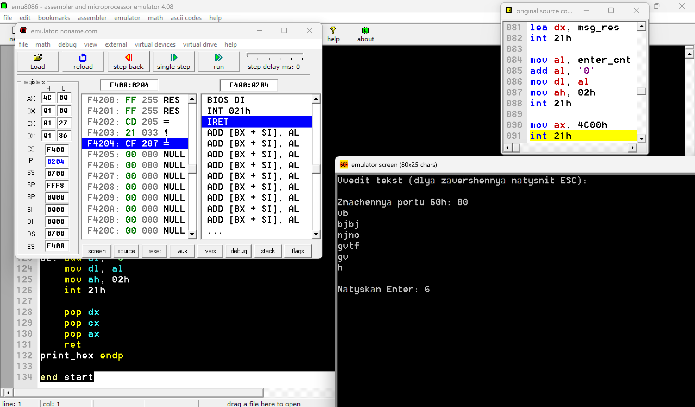

# ЗВІТ з практичної роботи №5

## 1. Мета роботи
Навчитися виводити текст і зчитувати ввід через переривання DOS, працювати з портами командами `in`/`out`, а також встановити власний обробник переривання клавіатури з обов'язковим відновленням оригінального вектора[cite: 1].


## 2. Початкові дані та інструменти
* **Інструмент симуляції:** emu8086[cite: 1]
* **Формат програми:** `.COM` (початковий адресний зсув `org 100h`)[cite: 1]
* **Завдання за варіантом 12:** Реалізувати обробник `int 9h`, який здійснює підрахунок кількості натискань клавіші **Enter** під час вводу тексту, вивести підсумок, відновити вектор `int 9h` та завершити програму[cite: 2].


## 3. Код програми

```csharp
org 100h            

jmp start           

msg_intro  db 'Vvedit tekst (dlya zavershennya natysnit ESC):', 0Dh, 0Ah, '$'
msg_port   db 0Dh, 0Ah, 'Znachennya portu 60h: $'
newline    db 0Dh, 0Ah, '$'
msg_res    db 0Dh, 0Ah, 'Natyskan Enter: $'

old_off    dw 0     
old_seg    dw 0  
enter_cnt  db 0   

start:
   
    mov ah, 09h
    lea dx, msg_intro
    int 21h

    in al, 60h
    push ax
    mov ah, 09h
    lea dx, msg_port
    int 21h
    pop ax
    call print_hex

    mov ah, 09h
    lea dx, newline
    int 21h
    
    mov ah, 35h
    mov al, 09h
    int 21h
    mov old_off, bx
    mov old_seg, es
    
    cli
    mov ah, 25h
    mov al, 09h
    lea dx, my_int9
    int 21h
    sti

read_loop:
    mov ah, 00h     
    int 16h
    
    cmp al, 13      
    jne check_esc
    inc enter_cnt   
    mov dl, 0Dh
    mov ah, 02h
    int 21h
    mov dl, 0Ah
    mov ah, 02h
    int 21h
    jmp read_loop

check_esc:
    cmp al, 27    
    je end_loop

    mov dl, al
    mov ah, 02h
    int 21h
    jmp read_loop

end_loop:
    cli
    mov ah, 25h
    mov al, 09h
    mov dx, old_off
    push ds
    mov ds, old_seg
    int 21h
    pop ds
    sti

    mov ah, 09h
    lea dx, msg_res
    int 21h

    mov al, enter_cnt
    add al, '0'
    mov dl, al
    mov ah, 02h
    int 21h

    mov ax, 4C00h
    int 21h

my_int9 proc
    pushf
    push ax
    in al, 60h  
    pop ax
    popf
    jmp dword ptr cs:[old_off]
my_int9 endp

print_hex proc
    push ax
    push cx
    push dx
    
    mov ch, al
    
    shr al, 4
    cmp al, 9
    jbe a1
    add al, 7
a1: add al, '0'
    mov dl, al
    mov ah, 02h
    int 21h
    
    mov al, ch
    and al, 0Fh
    cmp al, 9
    jbe a2
    add al, 7
a2: add al, '0'
    mov dl, al
    mov ah, 02h
    int 21h
    
    pop dx
    pop cx
    pop ax
    ret
print_hex endp

end start
```
## 4. Пояснення роботи з вектором переривань `int 9h`

* **Збереження вектора ($ah = 35h$):** Перед встановленням власного обробника необхідно зчитати системний вектор переривання `int 9h` за допомогою функції `AH=35h, AL=09h`. Адреса оригінального обробника (сегмент та зміщення) зберігається в змінних `old_seg` та `old_off`. Це дозволяє власному обробнику перенаправляти виконання до системного коду (`jmp dword ptr cs:[old_off]`) для забезпечення штатного функціонування клавіатури[cite: 2].
* **Відновлення вектора ($ah = 25h$):** Перед виходом з програми обов'язково відновлюється початковий вектор переривання за допомогою функції `AH=25h, AL=09h`[cite: 1]. Якщо цей крок пропустити, вектор у таблиці векторів переривань (IVT) залишиться вказувати на ділянку пам'яті, де знаходилася завершена програма[cite: 1]. Після вивантаження програми з пам'яті будь-яке наступне натискання клавіші викличе перехід за неіснуючою адресою, що призведе до фатального зависання всієї системи[cite: 1].

---

## 5. Скріншот результату виконання

# Відповіді на контрольні запитання

### 1. Чим відрізняються `ah = 09h` і `ah = 02h` для виводу тексту?
* **`ah = 09h`** — використовується для виведення **цілого рядка символів** з пам'яті, адреса якого передається в регістрі `DX` (рядок обов'язково повинен завершуватися символом `$`).
* **`ah = 02h`** — використовується для виведення **одного одиночного символу**, ASCII-код якого передається в регістрі `DL`.

### 2. Навіщо зберігати адресу оригінального обробника перед встановленням нового?
Адреса оригінального обробника зберігається для того, щоб:
1. Новий обробник міг викликати системну процедуру (через `jmp`) для збереження стандартної функціональності клавіатури (обробка буфера, спецклавіш тощо).
2. Програма мала змогу відновити початковий стан системи перед своїм завершенням.

### 3. Що станеться, якщо не відновити вектор `int 9h`?
Якщо вектор не відновити, у таблиці векторів переривань (IVT) залишиться адреса, що вказує на код програми, якого вже немає в пам'яті. При першому ж наступному натисканні будь-якої клавіші процесор перейде за цією недійсною адресою, що призведе до фатального збою, некоректного виконання випадкових команд і повного зависання операційної системи.

### 4. Чим `in`/`out` відрізняються від переривань BIOS/DOS?
* Команди **`in` / `out`** здійснюють **прямий апаратний доступ** до портів введення-виведення мікросхем та периферійних пристроїв на рівні шини процесора, минаючи будь-які програмні оболонки.
* Переривання **BIOS/DOS** — це **програмні функції високого та низького рівня**, які є абстракцією над залізом і самі всередині використовують команди `in`/`out` для безпечної та уніфікованої роботи з пристроями.

### 5. Яку роль відіграють `cli` і `sti` під час зміни вектора переривання?
* **`cli` (Clear Interrupt Flag)** — тимчасово вимикає масковані апаратні переривання. Це гарантує, що під час перезапису адреси вектора в пам'яті (яка складається з двох слів: сегмента та зсуву) не виникне випадкове переривання від клавіатури, коли адреса записана лише частково (захист від критичної помилки race condition).
* **`sti` (Set Interrupt Flag)** — повторно вмикає обробку апаратних переривань одразу після завершення процедури безпечної зміни вектора.