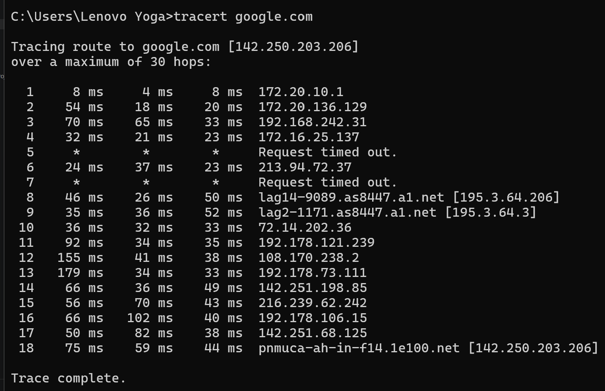

# Лекція №15

## Контрольні запитання

### 1. Чим CIDR відрізняється від класової адресації?

Класова адресація історично поділяла IPv4-адреси на класи A, B і C з фіксованою межею між номером мережі та номером вузла.

CIDR (Classless Inter-Domain Routing) дозволяє встановлювати межу мережі та вузла довільно за допомогою довжини префікса після символу `/`.

Наприклад, `192.168.10.0/24` означає, що перші 24 біти є номером мережі. CIDR дозволяє використовувати адресний простір ефективніше.

### 2. Що таке адреса мережі та широкомовна адреса підмережі?

**Адреса мережі** — це адреса, у якій усі біти вузлової частини дорівнюють нулю. Вона ідентифікує мережу в цілому та не призначається окремому вузлу.

**Широкомовна (broadcast) адреса** — це адреса, у якій усі біти вузлової частини дорівнюють одиниці. Вона використовується для розсилки даних усім вузлам підмережі.

Наприклад, для `192.168.20.64/28`:
- адреса мережі: `192.168.20.64`;
- діапазон вузлів: `192.168.20.65 – 192.168.20.78`;
- broadcast: `192.168.20.79`.

### 3. Розрахуйте кількість вузлів і маску для підмережі з вимогою 20 хостів.

Для 20 хостів потрібна підмережа, яка має щонайменше 20 придатних для вузлів адрес.

Для префікса `/27`:

- загальна кількість адрес: `2^(32-27) = 32`;
- адрес для вузлів: `32 - 2 = 30`;
- маска: `255.255.255.224`.

Отже, для 20 хостів підходить **`/27`**, яка дає **30 адрес для вузлів**.

### 4. Навіщо потрібні приватні діапазони адрес?

Приватні IPv4-діапазони використовуються для адресації вузлів у внутрішніх мережах. Вони не маршрутизуються напряму в глобальному Інтернеті.

Приватні діапазони RFC 1918:

- `10.0.0.0/8`;
- `172.16.0.0/12`;
- `192.168.0.0/16`.

Їх використання зменшує потребу в публічних IPv4-адресах завдяки NAT.

### 5. Які типи адрес існують в IPv6 і чим anycast відрізняється від multicast?

В IPv6 використовуються такі типи адрес:

- **Link-local** — `fe80::/10`, для обміну в межах одного локального сегмента;
- **Унікальна локальна (ULA)** — `fc00::/7`, для внутрішньої адресації;
- **Multicast** — `ff00::/8`, для групи вузлів;
- **Loopback** — `::1`, петльова адреса вузла;
- **Глобальна unicast** — адреси, які маршрутизуються в публічному Інтернеті.

**Anycast** синтаксично не відрізняється від unicast, але одна й та сама адреса призначається кільком вузлам. Пакет доставляється до найближчого з них за метрикою маршрутизації.

**Multicast** призначений для доставки пакета групі вузлів, тобто адресатами є всі вузли, що входять до відповідної multicast-групи.

### 6. Як працює утиліта traceroute на основі ICMP?

`traceroute` визначає маршрут пакета через послідовне збільшення значення TTL.

Пакет відправляється з певним значенням TTL. Коли TTL зменшується до нуля на проміжному маршрутизаторі, маршрутизатор повертає повідомлення про перевищення часу життя пакета. Аналізуючи такі відповіді, `traceroute` визначає проміжні маршрутизатори на шляху до вузла призначення.

У Windows використовується команда `tracert`, а в Linux/Mac — `traceroute`.

### 7. Чому підмережі методом VLSM обов'язково виділяють від найбільшої потреби до найменшої, а не в довільному порядку?

VLSM використовує підмережі різного розміру. Спочатку виділяють найбільший блок, потім менші.

Це потрібно для правильного вирівнювання блоків за межами їхнього розміру та для запобігання фрагментації адресного простору. Якщо спочатку виділяти маленькі підмережі, великий блок пізніше може не мати можливості початися з адреси, кратної його розміру. У результаті можуть виникнути невикористані «дірки» або перекриття підмереж.

### 8. Скільки підмереж дає додавання 4 бітів до префікса IPv6 і чому саме стільки?

Додавання 4 бітів дає:

`2^4 = 16`

Отже, утворюється **16 підмереж**.

В IPv6 це особливо зручно, тому що один шістнадцятковий символ відповідає рівно 4 бітам. Наприклад, префікс `/48` після додавання 4 бітів стає `/52`, а перша шістнадцяткова цифра четвертої групи може мати 16 значень: від `0` до `f`.

### 9. Чому в заголовку IPv6 прибрали контрольну суму порівняно з IPv4?

У IPv6 контрольну суму заголовка прибрали, щоб спростити обробку пакетів маршрутизаторами та пришвидшити їх проходження мережею.

Перевірку цілісності передано протоколам вищих рівнів і канальному рівню. Завдяки цьому маршрутизаторам не потрібно перераховувати контрольну суму на кожному транзитному вузлі.

# Домашнє завдання

## 1. Розрахунок підмережі

**Дано:**

- IP-адреса вузла: `10.20.5.130`
- маска: `/26`
- десяткова маска: `255.255.255.192`

Для `/26` маємо:

- `2^(32-26) = 64` адреси в одному блоці;
- придатних для вузлів: `64 - 2 = 62`.

Підмережі в останньому октеті йдуть із кроком 64:

- `0–63`;
- `64–127`;
- `128–191`;
- `192–255`.

Адреса `10.20.5.130` потрапляє до блоку `128–191`.

### Відповідь

| Параметр | Значення |
|---|---|
| Адреса вузла | `10.20.5.130` |
| Префікс | `/26` |
| Маска | `255.255.255.192` |
| Адреса мережі | `10.20.5.128` |
| Діапазон адрес вузлів | `10.20.5.129 – 10.20.5.190` |
| Широкомовна адреса | `10.20.5.191` |
| Кількість адрес у підмережі | `64` |
| Кількість адрес для вузлів | `62` |

**Отже:** адреса `10.20.5.130/26` належить мережі `10.20.5.128/26`, діапазон вузлів — `10.20.5.129–10.20.5.190`, broadcast — `10.20.5.191`.

## 2. Практика з командним рядком

Для перевірки маршруту до `google.com` було виконано команду:

```cmd
tracert google.com
```

### Результат

Трасування завершилося успішно на **18-му переході (hop)**.

- **Кількість переходів:** `18`
- **Максимальна кількість:** `30 hops`
- **Кінцева IP-адреса:** `142.250.203.206`
- **Результат:** `Trace complete.`

Під час трасування **5-й та 7-й переходи** не відповіли на запит і показали:

```text
Request timed out.
```

Проте трасування продовжилося та успішно завершилося на 18-му переході.

### Роль TTL

**TTL (Time To Live)** визначає максимальну кількість маршрутизаторів, через які може пройти пакет. У `tracert` значення TTL поступово збільшується, завдяки чому можна визначити кожен наступний маршрутизатор на шляху до кінцевого вузла. Коли TTL досягає нуля, маршрутизатор надсилає повідомлення про перевищення часу життя пакета, що дозволяє `tracert` визначити відповідний `hop`.

## 3. Приватний діапазон IPv4-адрес

Один із приватних діапазонів RFC 1918:

**`192.168.0.0/16`**

Ці адреси призначені для використання у внутрішніх мережах і **не маршрутизуються напряму в глобальному Інтернеті**. Це дозволяє використовувати приватні адреси всередині локальних мереж і зменшувати витрату публічних IPv4-адрес, зокрема завдяки NAT.